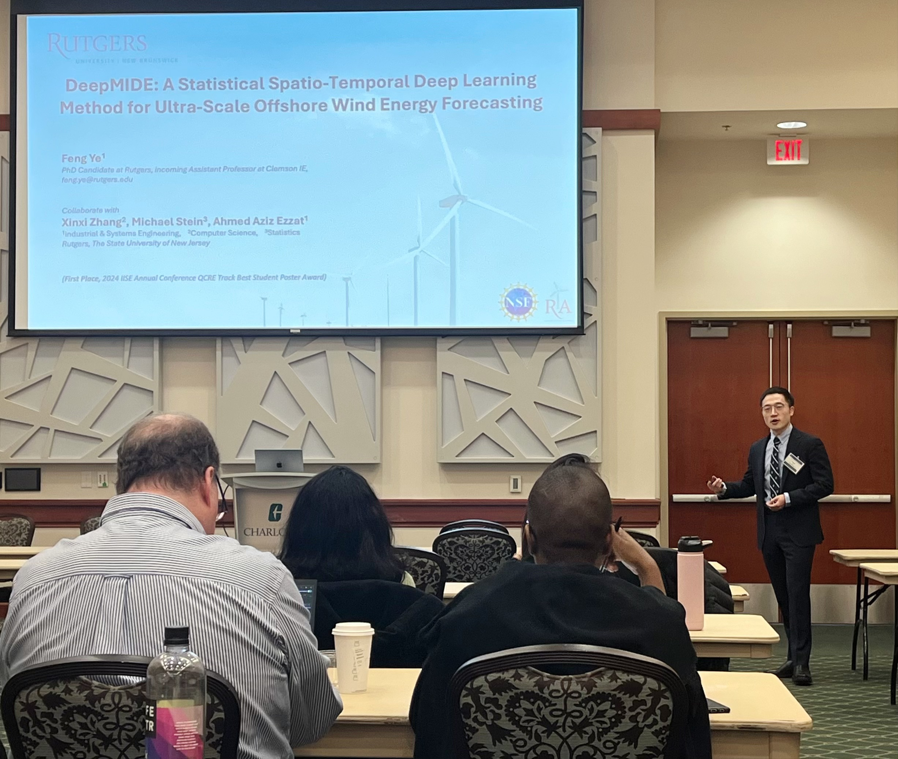








# 👨🏻‍🎓 About Me

I am a tenure-track Assistant Professor in the Department of Industrial Engineering at Clemson University . I received my Ph.D. in Industrial and Systems Engineering and an M.Sc. in Statistics from Rutgers University–New Brunswick . 

My research aims to advance the integration of statistics, physics, and modern AI/ML by constructing physics-guided data science models for sustainable energy and industrial applications.  

<strong>Research interest:</strong>

    

        <ul style="list-style-type: disc; padding-left: 20px; margin: 0;">
            <li>Physics-informed Data Science</li>
            <li>Spatio-temporal Modeling</li>
            <li>Probabilistic Forecasting</li>
        </ul>
    

    

        <ul style="list-style-type: disc; padding-left: 20px; margin: 0;">
            <li>Statistical Deep Learning</li>
            <li>Forecast-informed Decision Making</li>
            <li>Modeling & Analysis for Sustainable Energy</li>
        </ul>
    

------

**Ph.D. Students Position Opening:** *I am actively **looking for Ph.D. students** starting in Spring/Fall 2026 . Applicants with backgrounds in engineering, statistics, computer science, or related fields and strong coding skills are encouraged to apply. If interested, please email me your CV, transcript, and any additional materials that highlight your qualifications. Use **“Ph.D. Application – Your Name”** as the email subject. For more information, please check the Ph.D. programs at* [*Clemson IE*](https://www.clemson.edu/cecas/departments/ie/index.html).

# 🔥 News
- *2025.08*: I joined Department of Industrial Engineering at Clemson University  as a Tenure-track Assistant Professor!

- *2025.06*: I attended IISE Annual Conference & Expo 2025 in Atlanta!

- *2025.05*: 🎓🎓 I have successfully defended my Ph.D. dissertation, titled *“Physics-Guided Spatio-Temporal Data Science Models for Offshore Wind Energy Forecasting.”* Officially, Dr. Ye!

    

    

      
      
 
    

    

    

        
        

    

    

- *2025.03*: I attended the 2nd International Symposium on Energy Analytics (ISEA2025) and gave a presentation about our work *DeepMIDE*. Many thanks to Dr. Tao Hong for organizing the symposium!

    

    

      
      
 
    

    

    

        
        

    

    

- *2025.01*: I will join [Clemson IE](https://www.clemson.edu/cecas/departments/ie/index.html)  as a Tenure-track Assistant Professor!

# 🆠Honors and Awards

- 🥇**First Place**, [IISE QCRE Track Best Student Poster Award](https://soe.rutgers.edu/news/ise-phd-student-wins-best-student-poster-competition-iise-annual-conference), *2024* 
- 🥇**First Place**, [IISE Energy Systems Track Best Paper Award](https://www.linkedin.com/posts/feng-ye-51b3ba252_iiseannual2023-offshorewind-offshorewindenergy-activity-7067279451163611137-S8Bz?utm_source=share&utm_medium=member_desktop&rcm=ACoAAD5aBWcBmRGppw0q2rC85jjxX3ZSKCev4Jc), *2023* 
- 🥇**First Place**, [INFORMS Sustainability Cluster Best Student Paper Award](https://academicaffairs.rutgers.edu/njwind/fengye-wins-INFORMS-award), *2022* 
- New Jersey Wind Institute Fellowship (awarded to 10 graduate students in NJ per year), *2023*
- Rutgers Climate and Energy Institute (RCEI) Student Support Funding Award, *2024*
- Outstanding Ph.D. Student Award (Research), Department of Industrial & Systems Engineering , Rutgers University, *2024*
- Research & Travel Award, School of Graduate Studies, Rutgers University, *2024*
- Graduate Student Service Award, Department of Industrial & Systems Engineering, Rutgers University,  *2024*
- Rutgers University Fellowship, Department of Industrial & Systems Engineering, Rutgers University, *2024*

# 📠Publications
## Journal Papers

1. **F. Ye**, X. Zhang, M. Stein, and A. Ezzat, “[DeepMIDE: A Multivariate Spatio-Temporal Method for Ultra-Scale Offshore Wind Energy Forecasting](https://arxiv.org/abs/2410.20166)”, *Technometrics*, 2025, Under 2nd review
   - *First Place, 2024 IISE Annual Meeting QCRE Track Best Student Poster Award*

2. **F. Ye**, J. Brodie, T. Miles, and A. Ezzat, “[AIRU-WRF: A Physics-guided Spatio-temporal Wind Forecasting Model and Its Application to the U.S. Mid Atlantic Offshore Wind Energy Areas](https://www.sciencedirect.com/science/article/abs/pii/S0960148123018499)”, *Renewable Energy*, vol. 223, p. 119 934, 2024.
   - *First Place, 2023 IISE Annual Meeting Energy Systems Track Best Paper Award*
   - *First Place, 2022 INFORMS Annual Meeting Sustainability Cluster Best Student Paper Award*

3. **F. Ye**, T. Miles, and A. Ezzat, “[Improved Spatio-Temporal Offshore Wind Energy Forecasting with Coastal Upwelling Information](https://www.sciencedirect.com/science/article/pii/S0306261924023948)”, *Applied Energy*, vol 380, p.125010, 2024.
4. **F. Ye**, and A. Ezzat, “[Icing Detection and Prediction for Wind Turbines Using Multivariate Sensor Data and Machine Learning](https://www.sciencedirect.com/science/article/pii/S0960148124009479)”, *Renewable Energy*, vol. 231, p. 120 879, 2024.
5. **F. Ye**, Z. Zhang, Z. Xia, Y. Zhou and H. Zhang, “[Monitoring and Diagnosis of Multi-channel Profile Data Based on Uncorrelated Multilinear Discriminant Analysis](https://link.springer.com/article/10.1007/s00170-019-03912-x)”, *The International Journal of Advanced Manufacturing Technology*, vol. 103, pp. 4659–4669, 2019.
6. **F. Ye**, Y. Guo, Z. Xia, Z. Zhang and Y. Zhou, “[Feature Extraction and Process Monitoring of Multi-channel Data in a Forging Process via Sensor Fusion](https://www.tandfonline.com/doi/abs/10.1080/0951192X.2020.1858509)”, *International Journal of Computer Integrated Manufacturing*, vol. 34, no. 1, pp. 95–109, 2021.
7. Y. Guo, **F. Ye**, Y. Zhou and Z. Zhang, “[Fault Diagnosis of Multi-channel Data in a Forging Process Using the Linear Support Higher-order Tensor Machine](https://www.tandfonline.com/doi/abs/10.1080/0951192X.2020.1780321)”, *International Journal of Computer Integrated Manufacturing*, vol. 33, no. 8, pp. 810–822, 2020.
   

## Book Chapters

1. **F. Ye**, T. Miles, and A. Ezzat, Offshore Wind Energy Prediction Using Machine Learning with Multi-Resolution Inputs in book “[Multimodal and Tensor Data Analytics for Industrial Systems Improvement](https://link.springer.com/book/10.1007/978-3-031-53092-0)”, Springer Optimization and Its Application, pp. 167–183, 2024.

## Conference Papers:

1. **F. Ye**, J. Brodie, T. Miles, and A. Ezzat, “[Ultra-Short-Term Probabilistic Wind Forecasting: Can Numerical Weather Predictions Help?](https://ieeexplore.ieee.org/document/10252311)”, In 2023 IEEE Power & Energy Society General Meeting (PESGM), pp.1–5, 2023.

2. **F. Ye**, and A. Ezzat, “[An Integro-Difference Equation Model for Spatio-Temporal Offshore Wind Forecasting](https://ieeexplore.ieee.org/document/10688765)”, In 2024 IEEE Power & Energy Society General Meeting (PESGM), pp.1–5, 2024.

## Patents
1. **F. Ye**, J. Brodie, T. Miles, and A. Ezzat, “Techniques to Provide Improved Wind Input for Operating Offshore Wind Turbines” (International Application #: PCT/US23/73816)
2. Z. Zhang, **F. Ye**, C. Zhen and M. Dai, “Remote Data Acquisition and Analysis for Process Diagnosis in the Production Line” (in Chinese, Patent #: CN201810868396.X)

# 💬 Invited / Conference Presentations

- **An Integro-Difference Equation Model for Spatio-Temporal Offshore Wind Forecasting**

  - *IEEE Power & Energy Society General Meeting, Seattle, WA July 2024*
- **A Statistical Deep Learning Approach for Offshore Wind Energy Forecasting**
  - *International Symposium on Energy Analytics, Charlotte, NC March 2025*
  - *Rutgers Climate Symposium, New Brunswick, NJ Nov. 2024*
  - *INFORMS Annual Meeting, Seattle, WA Oct. 2024*
  - *IISE Annual Conference & Expo, Montreal, Canada May 2024*
- **AIRU-WRF: A Physics-guided Spatio-temporal Wind Forecasting Model and Its Application to the U.S. Mid Atlantic Offshore Wind Energy Areas**
  - *NAWEA/WindTech 2024 Conference, New Brunswick, NJ Oct. 2024*

  - *New Jersey Offshore Wind Technology Conference, Newark, NJ Dec. 2023*

  - *Rutgers Climate Symposium, New Brunswick, NJ Nov. 2023*

  - *INFORMS Annual Meeting, Phoenix, AZ Oct. 2023*

  - *Wind Institute Research Symposium, Trenton, NJ Apr. 2023*

  - *INFORMS Annual Meeting, Indianapolis, IN Oct. 2022*

  - *IISE Annual Conference & Expo, Seattle, WA May 2022*

- **Ultra-Short-Term Probabilistic Wind Forecasting: Can Numerical Weather Predictions Help?**
  - *IEEE Power & Energy Society General Meeting, Orlando, FL July 2023*

  - *IISE Annual Conference & Expo, New Orleans, LA May 2023*

# 👨🏻‍🏫 Teaching/Mentoring

- #### **Instructor** (with full responsibility) 06-07/2022, 2023

   Summer 440 EOF Matlab Computer Programming

  

- #### **Teaching Assistant** 01/2022 - 05/2022

  - 14:540:343: Engineering Economics

  - 14:540:462: Facilities Layout and Materials Handling

    

- #### **Student Mentoring**

  ###### Master student researchers

  - Cory Petersen 09/2024 - 06/2025

    *Topic: Accessibility Forecasting for Wind Farm Operations Considering Metocean Conditions*

  - Xinxi “Chris” Zhang 09/2023 - 05/2024

    *Topic: A Statistical Deep Learning Approach for Offshore Wind Energy Forecasting*

  

  ###### Undergraduate researchers

  - Prisha Bhamre (NSF REU) 09/2024 - 12/2024

    *Topic: A Surrogate Model for Wind Farm Wake Effects*

  - Briana Worrell (ARESTY) 09/2024 - 06/2025

    *Topic: Digital Twins for Offshore Wind Farms*

  - Jeeva Ramasamy (NJEDA OSW Fellowship Program) 09/2023 - 06/2025

    *Topic: Data Science for Offshore Wind Energy Operations and Forecasting*

  - Andrei Dimitriu (NJEDA OSW Fellowship Program) 08/2022 - 06/2023

    *Topic: Data Analysis & Processing for the Offshore Wind Energy Areas in the Mid-Atlantic*

  - Althea Miquela (NSF REU) 08/2022 - 06/2023

    *Topic: Defect Detection in Solar Photovoltaic Systems Using UAVs and Machine Learning*

    *(First Place, Best Student Paper Competition at the IEOM’s 8th North American Conference)*

# 📚 Professional Service and Membership

- **Vice President**: Rutgers INFORMS Student Chapter (Cum Laude Award) 10/2022 - 06/2025

  

    

      
      
Volleyball game 
  between ISE faculty & students

  

  

      
      
Joint seminar with Lehigh 
  INFORMS Student Chapter

  

  

      
      
Cum Laude Award from INFORMS
  

  

  

- **Session chair**:

  - *“Predictive Analytics for Wind Power Generation”, IISE, Montreal, Canada, May 2024*
  - *“Unique Directions in Energy Research”, IISE, Montreal, Canada, May 2024*
  - *“Forecasting and Data Science for Renewable Energy”, INFORMS, Indianapolis, IN, Oct. 2022*

- **Journal Reviewer for**:

  *Technometrics, IISE Transactions, IEEE Transactions on Automation Science and Engineering, IEEE Transactions on Sustainable Energy, Renewable Energy, International Journal of Production Research, Applied Energy, INFORMS Journal on Data Science, Frontiers in Marine Science*

- **Memberships**:

  - Institute of Industrial and Systems Engineers (IISE)
  - Institute for Operations Research and the Management Sciences (INFORMS)
  - Institute of Electrical and Electronics Engineers (IEEE)

  

# 🏃🏻 Personal

Outside research, I am all about sports and outdoor adventures! You’ll often find me running marathons,trails and mountains, climbing rocks, or hiking. 🏃🏻🧗🏻‍♂️🚀🏔️🔥

  

    
    
Jersey City Half Marathon -- 1:28

    
    <!-- No caption for this one -->

    
    <!-- No caption for this one -->

    

    
    <!-- No caption for this one -->

    
    <!-- No caption for this one -->

# 🌏️ Map

